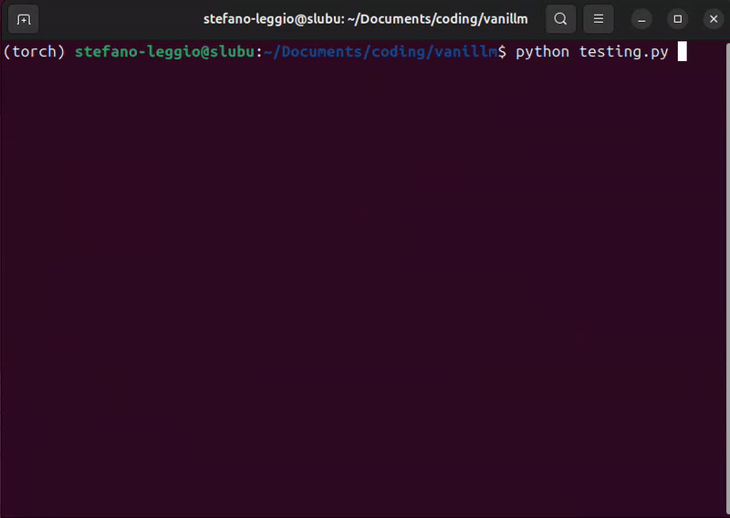

# **VaniLLM**
A simple Large Language Model built from scratch for text completion.

## **Overview**
VaniLLM is a small educational LLM implemented entirely from scratch in Python and PyTorch.
It is trained and tested on a single poem — Shakespeare’s *Sonnet 18* — and can generate the continuation of the text given a prompt.

This project is a toy example designed to understand how transformers, embeddings, attention mechanisms, and autoregressive text generation work internally.

---

## **How It Works**

### 1. Install dependencies

    pip install -r install.txt

### 2. Configure shared parameters (optional)

All common hyperparameters (block size, embedding dimension, paths, etc.) are defined in:

    shared.py

You can modify them freely.

### 3. Train the model

    python training.py

This script will:
- tokenize the poem  
- build the training batches  
- train the transformer from scratch  
- save the model to *vanillm.pth*

### 4. Test the model

    python testing.py

The script will ask:
1. How many characters to generate  
2. A starting sentence or a few words from the poem  

The model will then generate the continuation of the text directly in the terminal, character by character.

---

## **Notes**
- This is not a full LLM — it is a minimal and educational implementation of a transformer for next-character prediction.
- The network is intentionally small and trained on a tiny dataset to keep the entire pipeline understandable.
- Ideal for learning the mechanics of LLMs: embeddings, positional encodings, attention, and autoregressive sampling.

---
